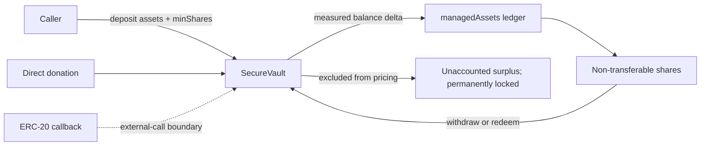

[](https://github.com/BogDanBots/solidity-security-vault/actions/workflows/ci.yml)

# SecureVault — compact Solidity security portfolio project

SecureVault is a deliberately small, single-asset ERC-20 vault written for reviewability. It demonstrates accounting, explicit authorization, reentrancy boundaries, adversarial token testing, fuzzing, invariants and static analysis without introducing an unnecessary strategy layer.

This is an open-source portfolio project, not a production vault and not an audit. It does not copy the private SolTrench vault implementation.

## Architecture



## Design choices

- One immutable underlying ERC-20 asset.
- Non-transferable internal shares to keep the ownership surface small.
- A managed-asset ledger that ignores unsolicited donations when pricing shares.
- A caller-supplied minimum-share constraint on every deposit.
- Deposit cap, pause control and two-step ownership transfer.
- No strategy adapter, yield source or live-funds integration.
- Underlying asset cannot be recovered through the administrative token-recovery function;
  direct donations remain observable as unaccounted surplus but are not claimable by shares.
  Direct donations are permanently locked in this compact design: neither the owner nor
  share holders can recover or distribute them.

## Review focus

The most important files are `src/SecureVault.sol`, `docs/threat-model.md` and the Foundry tests. The test suite covers normal flows, rounding, authorization, pause behavior, donation resistance, adversarial token callbacks, token return failures, incoming fee-on-transfer accounting, fuzzed amounts and stateful invariants with two independent actors, donation actions and cross-account redemption attempts.

## Current verification status

The `main` branch currently passes the repository's format, build, unit/fuzz,
invariant and Slither-baseline checks in CI. The Slither findings remain visible
and are reviewed against an explicit baseline; they are not silently suppressed
or presented as a clean-audit result.

## Verification

The repository uses Foundry 1.8.1, Solidity 0.8.24 and Slither 0.11.6 in CI.
The latest local verification completed with format checks, a successful build,
13 unit/fuzz tests, and a 64-run stateful invariant campaign at 128 calls per
run. Slither's 15 reviewed findings are documented in
[`docs/slither-results.md`](docs/slither-results.md).

Install Foundry and the pinned `forge-std` test dependency:

```bash
forge install foundry-rs/forge-std@16cb9c998736cab8f14aebd5199cdf6a02fde055 --no-commit
```

Then run the commands in
[`docs/testing-and-analysis.md`](docs/testing-and-analysis.md). This is an
open-source portfolio project, not an audit, security guarantee or production
readiness claim.
